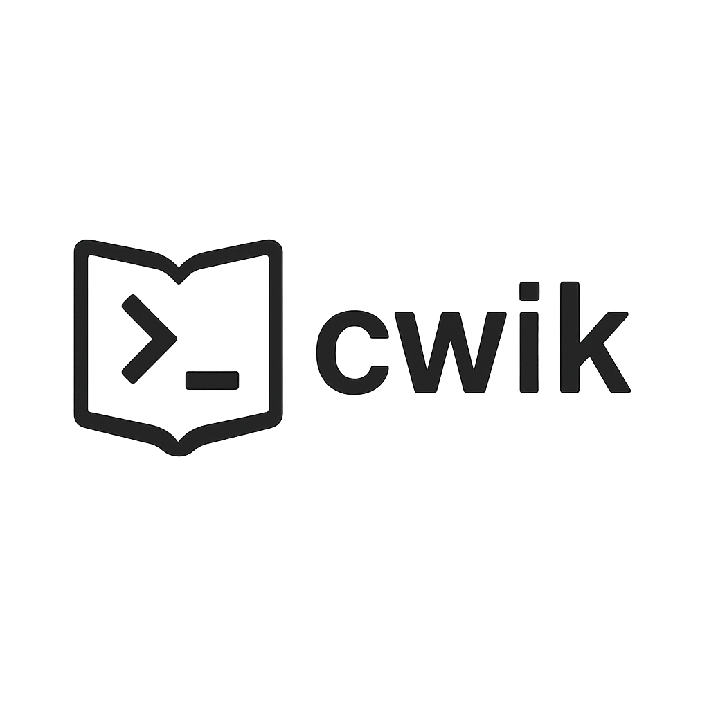

# cwik
<p align="center">
  
</p>


> A terminal-based personal wiki with categories, article management, and SQLite storage — built for Linux users who live in the shell.

---

## 🚧 Status

**Work in progress** — core features like article creation, editing, browsing, and category management are under active development. Expect breakage, missing features, and constant improvements.

---

## 💡 What is cwik?

**cwik** is a command-line wiki system for organizing knowledge in a structured, category-based way — entirely from the terminal. Think of it like `man`, but for your personal notes, system setups, access credentials, ideas, etc.

It's built for users who prefer minimal, fast, and keyboard-driven workflows. Articles are edited in your `$EDITOR`, stored in an SQLite database, and organized hierarchically like directories.

---

## 🔧 Syntax (WIP)

```bash
cwik create category "Linux"
cwik create category "SSH" /Linux
cwik create article "Key Setup" /Linux/SSH
cwik edit /Linux/SSH/Key\ Setup
cwik view /Linux/SSH/Key\ Setup
cwik list /Linux
cwik search "ssh key"
cwik delete article /Linux/SSH/Key\ Setup
```

Future features will include tagging, import/export, Git sync, and a web UI on top of the same DB.

---

## 📦 Requirements

- Linux
- `bash`
- `sqlite3`
- Any terminal editor (`vim`, `nano`, `micro`, etc.)

---

## 📁 Structure

- SQLite DB stores articles and categories
- Articles can be viewed, edited, and searched via CLI
- Hierarchical category tree (e.g. `/Linux/SSH/Key Setup`)

---

## 📜 License

MIT (eventually)

---

## 🛠 Contributions

Not open yet — but feel free to watch/star the repo and give feedback via Issues.

---

## 💬 Ideas / Bugs / Feedback?

Open an Issue or yell at the void.

---

**Built for people who'd rather type than click.**
